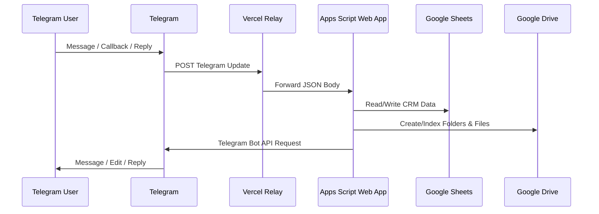

# مستندات API و Webhook کاراترخیص

## مقدمه

کاراترخیص در V4.9.2 یک **Public REST API عمومی برای مشتریان خارجی ندارد**. سطح API فعلی عمدتاً برای این موارد استفاده می‌شود:

1. دریافت Updateهای Telegram از طریق Webhook
2. ارسال درخواست از Apps Script به Telegram Bot API
3. دسترسی داخلی Apps Script به Google Sheets و Google Drive
4. Relay کردن Webhook از Vercel به Apps Script

این سند قراردادهای فنی موجود را توضیح می‌دهد.

---

## معماری API



---

# 1. Apps Script Health Endpoint

## `GET <APPS_SCRIPT_WEB_APP_URL>`

### هدف

بررسی اینکه Web App در دسترس است و چه نسخه‌ای فعال است.

### Request

```http
GET https://script.google.com/macros/s/<deployment-id>/exec
```

### Response نمونه

```text
KARATARKHIS CRM BOT V4.9.2 ONLINE
```

### Status

Apps Script معمولاً Response متنی برمی‌گرداند. در مانیتورینگ باید علاوه بر HTTP response، متن Version نیز بررسی شود.

---

# 2. Telegram Webhook Ingress

## `POST <RELAY_URL>/api/telegram-webhook`

### هدف

دریافت Update تلگرام و Forward آن به Apps Script Web App.

در Production فعلی از Relay استفاده می‌شود چون مسیر مستقیم Telegram → Apps Script در مراحل قبلی با Redirect/HTTP behavior نامناسب مواجه شده بود.

### Content-Type

```http
Content-Type: application/json
```

### Payload

Payload همان Telegram Update Object است.

### نمونه Message Update

```json
{
  "update_id": 123456789,
  "message": {
    "message_id": 100,
    "from": {
      "id": 123456,
      "first_name": "Example"
    },
    "chat": {
      "id": -1001234567890,
      "type": "supergroup",
      "title": "Operations"
    },
    "date": 1760000000,
    "text": "/version"
  }
}
```

### نمونه Callback Query

```json
{
  "update_id": 123456790,
  "callback_query": {
    "id": "callback-id",
    "from": {
      "id": 123456
    },
    "message": {
      "message_id": 200,
      "chat": {
        "id": 123456,
        "type": "private"
      }
    },
    "data": "menu_today"
  }
}
```

### Update Types لازم

Webhook باید حداقل این موارد را دریافت کند:

```json
[
  "message",
  "callback_query"
]
```

اگر `callback_query` حذف شود، دکمه‌های Inline نمایش داده می‌شوند اما Action آن‌ها به Backend نمی‌رسد.

---

# 3. Apps Script `doPost(e)`

## قرارداد داخلی

Apps Script از `e.postData.contents` انتظار JSON معتبر Telegram Update دارد.

### رفتار

1. بررسی وجود Body
2. Parse JSON
3. ثبت Debug Trace
4. Duplicate Protection با `update_id`
5. Route به `handleTelegramUpdate(update)`
6. ثبت خطا در Script Properties/Log
7. پاسخ `OK`

### پاسخ‌ها

#### Body ندارد

```text
NO DATA
```

#### درخواست معتبر یا حتی خطای Handler

```text
OK
```

> در نسخه فعلی Error داخلی Logging می‌شود و Endpoint همچنان `OK` برمی‌گرداند تا Telegram Retry Loop کنترل شود. برای مانیتورینگ واقعی باید Apps Script Executions/Logs نیز بررسی شوند.

---

# 4. Duplicate Protection

Telegram ممکن است یک Update را Retry کند. سیستم از `CacheService` و کلید زیر استفاده می‌کند:

```text
TG_UPDATE_<update_id>
```

TTL فعلی:

```text
6 hours
```

اگر Update قبلاً دیده شده باشد، دوباره پردازش نمی‌شود.

---

# 5. Telegram Bot API — Outbound

Apps Script از الگوی زیر استفاده می‌کند:

```http
POST https://api.telegram.org/bot<BOT_TOKEN>/<method>
Content-Type: application/json
```

## Methodهای استفاده‌شده

| Method | کاربرد |
|---|---|
| `sendMessage` | ارسال پیام، کارت Task و گزارش |
| `editMessageText` | Update پیام Private/Inline |
| `deleteMessage` | پاک‌کردن برخی پیام‌های UI |
| `answerCallbackQuery` | ACK دکمه Inline |
| `setWebhook` | تنظیم Webhook |
| `getWebhookInfo` | Diagnostic |
| `deleteWebhook` | حذف Webhook |

---

## 5.1 `sendMessage`

### Payload نمونه

```json
{
  "chat_id": "-1001234567890",
  "text": "📌 <b>کار جدید | کاراترخیص</b>",
  "parse_mode": "HTML",
  "disable_web_page_preview": true
}
```

### Reply روی پیام Task

```json
{
  "chat_id": "-1001234567890",
  "text": "⏰ یادآوری Task عقب‌افتاده",
  "parse_mode": "HTML",
  "reply_parameters": {
    "message_id": 271,
    "allow_sending_without_reply": true
  }
}
```

---

# 6. Commandهای Telegram

Commandها برای Diagnostic/Backward Compatibility وجود دارند؛ Private Menu برای استفاده روزانه بدون Command طراحی شده است.

| Command | کاربرد |
|---|---|
| `/version` | نسخه فعال |
| `/id` | Chat ID و اطلاعات Chat |
| `/today` | Taskهای امروز — Legacy command |
| `/tomorrow` | Taskهای فردا — Legacy command |
| `/report` | گزارش روز — Legacy command |
| `/marketing` | گزارش بازاریابی |
| `/help` | راهنمای پایه |
| `/menu` | بازکردن پنل Private در جریان‌های جدید |

---

# 7. Task Reply Contract

کارت Task شامل Task ID است.

الگوهای معتبر:

```text
KRT-1A2B3C4D
ARD-1A2B3C4D   # Legacy
```

مسئول روی پیام اصلی Reply می‌کند. Handler ابتدا Task ID یا Telegram Message ID را Resolve و سپس دسترسی مسئول را بررسی می‌کند.

### نمونه Reply انسانی

```text
انجام شد
```

یا:

```text
نتیجه: مدارک تحویل گمرک شد
```

یا:

```text
در حال انجام
فردا پیگیری شود
```

Parser سیستم می‌تواند وضعیت و نتیجه را از متن استخراج و در Sheet ذخیره کند.

---

# 8. Callback Query Contract

Private UI ممکن است از Inline Keyboard استفاده کند. Callback باید توسط Webhook دریافت شود.

نمونه مفهومی:

```json
{
  "callback_query": {
    "id": "abc",
    "from": {"id": 123456},
    "data": "<action>",
    "message": {
      "chat": {"id": 123456},
      "message_id": 99
    }
  }
}
```

پس از دریافت، Bot باید `answerCallbackQuery` را فراخوانی کند تا Telegram UI در حالت Loading باقی نماند.

---

# 9. Google Sheets Integration Contract

Google Sheets در این پروژه نقش Storage و Operational UI را دارد؛ API خارجی نیست اما Business Contract داخلی محسوب می‌شود.

## Task Sheet

`کارهای روزانه`

ستون‌های پایه V4.9.2:

| Column | نام |
|---|---|
| A | تاریخ |
| B | مسئول |
| C | دسته‌بندی |
| D | کار روزانه |
| E | مرتبط با شرکت |
| F | اولویت |
| G | موعد |
| H | وضعیت |
| I | نتیجه |
| J | کار فردا |
| K | یادداشت مدیریتی |
| L | شناسه کار |
| M | Telegram Message ID |
| N | آخرین یادآوری |
| O | ارسال به کارمند |

### Invariant مهم

`Telegram Message ID` برای Reply Lifecycle لازم است و نباید بدون Migration حذف یا تغییر نوع داده دهد.

---

# 10. Case Form Contract

Sheet: `پرونده جدید`

| Cell | معنی |
|---|---|
| B3 | مشتری / صاحب کالا |
| B4 | نوع پرونده: واردات / صادرات |
| B5 | شماره پرونده اصلی |
| B6 | شماره کوتاژ / سند اختیاری |
| B7 | وضعیت |
| B8 | مسئول |
| B9 | یادداشت |
| B10 | Checkbox ثبت |
| B11 | نتیجه ثبت |
| B12 | شماره پرونده ثبت‌شده |
| B13 | لینک پوشه اسناد |
| B15 | Checkbox پرونده جدید |
| B16 | وضعیت فرم |

---

# 11. Customer Form Contract

Sheet: `مشتری جدید`

Fieldهای اصلی:

```text
نوع مشتری
نام مشتری
شناسه ملی / کد ملی
شماره ثبت
کد اقتصادی
شخص رابط
موبایل
تلفن
ایمیل
استان / شهر
آدرس
شروع وکالت
پایان وکالت
یادداشت
```

Actionها:

```text
B17 = ثبت مشتری
B22 = ➕ مشتری جدید / Reset
```

---

# 12. Error Handling

### Telegram API Error

Wrapper در صورت `ok=false` خطا Throw می‌کند:

```text
Telegram API Error: <raw response>
```

### Config Error

نمونه:

```text
BOT_TOKEN تنظیم نشده است.
SPREADSHEET_ID در Script Properties تنظیم نشده است.
GROUP_CHAT_ID is missing in Script Properties.
```

### Sheet/Folder Error

در صورت نبود Sheet یا Folder ID معتبر، عملیات باید Fail شود و در Apps Script Executions قابل مشاهده باشد.

---

# 13. امنیت API

- `BOT_TOKEN` در URL درخواست Telegram قرار می‌گیرد؛ URL کامل نباید Log شود.
- Webhook endpoint عمومی است؛ Payload نباید بدون Validation به Actionهای حساس تبدیل شود.
- در نسخه آینده بهتر است Relay یک Secret Header بین Vercel و Apps Script اضافه کند.
- Apps Script Web App باید فقط با Scopeهای لازم Deploy شود.
- هیچ API برای دریافت مستقیم Customer Data از اینترنت عمومی وجود ندارد.

---

# 14. APIهای پیشنهادی آینده

اگر کاراترخیص در آینده Mini App/Web Admin مستقل داشته باشد، API پیشنهادی:

```text
GET    /api/v1/me
GET    /api/v1/tasks
POST   /api/v1/tasks
PATCH  /api/v1/tasks/:id
GET    /api/v1/customers
POST   /api/v1/customers
GET    /api/v1/cases
POST   /api/v1/cases
GET    /api/v1/reports/daily
GET    /api/v1/reports/monthly
```

این Endpointها **در V4.9.2 وجود ندارند** و فقط Roadmap معماری هستند.
