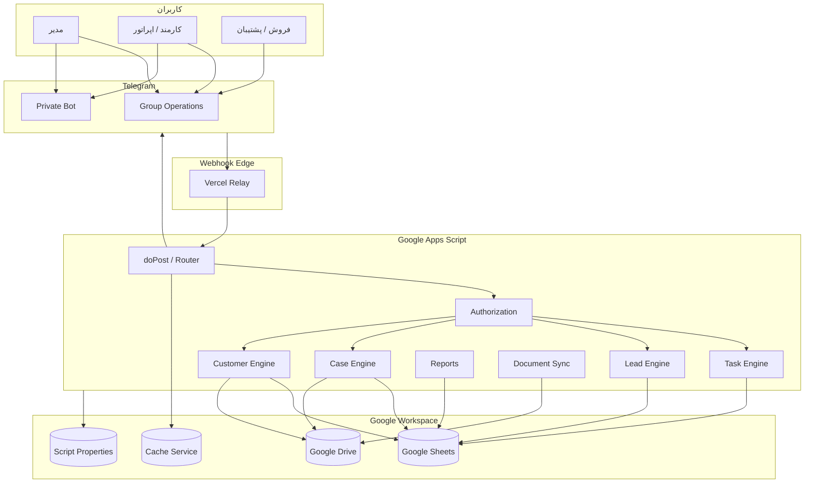
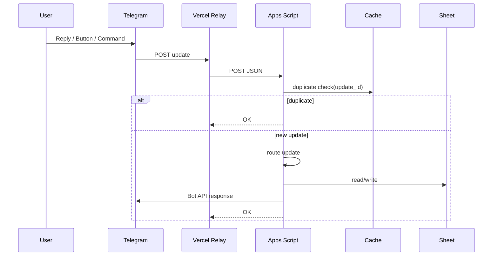
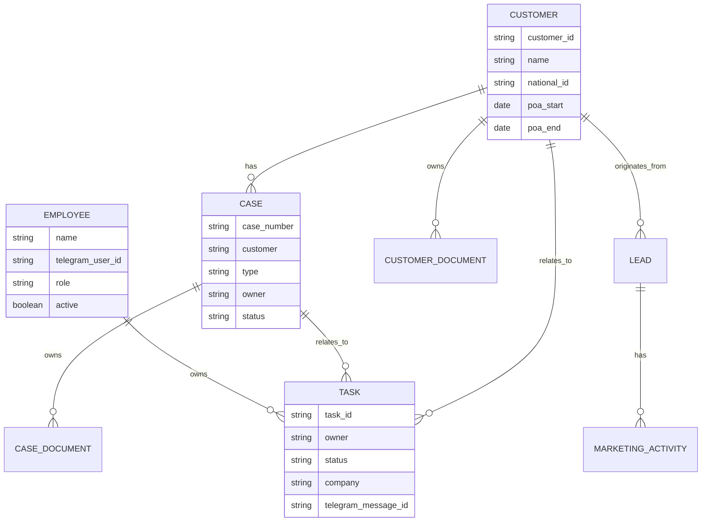

# معماری کاراترخیص

## 1. نمای کلی

کاراترخیص یک سیستم **Serverless / Low-Code Hybrid CRM** است که هسته آن بر Google Apps Script و Google Workspace قرار دارد و Telegram به‌عنوان رابط عملیات تیمی استفاده می‌شود.

معماری V4.9.2 به‌صورت زیر است:



---

## 2. اصول معماری

### 2.1 Google Sheets به‌عنوان Operational Database

در نسخه فعلی، Google Sheets هم Data Store و هم UI مدیریتی است. مزایا:

- سرعت توسعه بالا
- دسترسی آشنا برای تیم
- گزارش‌گیری دستی ساده
- Data Validation و Checkbox
- عدم نیاز به پنل Backend جداگانه

محدودیت‌ها:

- Transaction واقعی وجود ندارد.
- Schema توسط کاربر قابل تغییر است.
- Concurrency محدودتر از Database استاندارد است.
- Foreign Key واقعی وجود ندارد.
- Audit Trail باید به‌صورت دستی ساخته شود.

برای مقیاس فعلی این انتخاب مناسب است، اما برای رشد زیاد باید مهاجرت به Database واقعی بررسی شود.

---

## 3. لایه‌ها

### 3.1 Presentation Layer

#### Google Sheets

برای ورود و مدیریت داده:

- فرم Task
- فرم پرونده
- فرم مشتری
- بازاریابی و لید
- داشبورد مدیریتی

#### Telegram Group

برای عملیات شفاف تیمی:

- Task Card
- Reply
- Reminder
- گزارش
- Alert

#### Telegram Private

برای:

- خلاصه فردی
- اطلاعات Role-Based
- گزارش شخصی
- داده‌های حساس‌تر

---

### 3.2 Application Layer — Apps Script

Apps Script مسئول Business Logic است:

- Webhook Routing
- Authorization
- Sheet Read/Write
- Task Lifecycle
- Lead Reminder
- Drive Folder Management
- Document Indexing
- Report Generation
- Trigger Management

---

### 3.3 Integration Layer

#### Telegram Bot API

برای `sendMessage`, `editMessageText`, `deleteMessage`, `answerCallbackQuery` و Webhook Administration.

#### Vercel Relay

Telegram Update را به Apps Script Forward می‌کند.

#### Google Drive

Storage اسناد و Folder Hierarchy را مدیریت می‌کند.

---

## 4. جریان Webhook



Duplicate Update با `CacheService` و TTL شش‌ساعته کنترل می‌شود.

---

## 5. مدل داده و Sheetها

### 5.1 `کارهای روزانه`

مرکز Taskهای سیستم.

| ستون | مفهوم |
|---|---|
| A | تاریخ |
| B | مسئول |
| C | دسته‌بندی |
| D | Task |
| E | شرکت مرتبط |
| F | اولویت |
| G | موعد |
| H | وضعیت |
| I | نتیجه |
| J | اقدام/کار فردا |
| K | یادداشت مدیریتی |
| L | Task ID |
| M | Telegram Message ID |
| N | آخرین یادآوری |
| O | ارسال به کارمند |

روابط:

```text
کارهای روزانه.E → مشتری/شرکت
کارهای روزانه.L → Telegram Card Identifier
کارهای روزانه.M → Telegram Message
کارهای روزانه.B → کارمندان.name
```

---

### 5.2 `کارمندان`

رجیستری احراز هویت Telegram.

مدل فعلی پنج فیلد پایه دارد:

```text
name
telegram_user_id
role
active
username
```

Authorization بر اساس `telegram_user_id` انجام می‌شود.

---

### 5.3 `سرنخ‌ها`

Lead Master Table.

فیلدهای مهم شامل:

```text
ID
Created
Company
Contact
Phone
Field
Goods
Source
Reason
Score
Stage
Owner
Last Contact
Result
Next Action
Next Follow-up
Value
Probability
Status
Note
Batch ID
Assigned At
Last Activity At
Reminder Count
Last Reminder At
Escalation Level
Closed At
Close Reason
```

---

### 5.4 `بازاریابی و پیگیری`

برای تاریخچه و گزارش عملیات بازاریابی/تماس‌ها استفاده می‌شود.

---

### 5.5 `پرونده جدید`

فرم ایجاد Case.

```text
B3  مشتری
B4  نوع پرونده
B5  شماره پرونده
B6  کوتاژ/سند
B7  وضعیت
B8  مسئول
B9  یادداشت
B10 ثبت
B11 نتیجه ثبت
B12 شماره ثبت‌شده
B13 Folder Link
B15 New Case Action
B16 Form Status
```

---

### 5.6 `پرونده‌ها و تسویه اردوان`

Master Table پرونده‌ها. نام Sheet Legacy است و در Refactor V5 بهتر است به نام خنثی مثل `پرونده‌ها` تغییر کند.

ستون‌های فعلی شامل شناسه پرونده، شرکت، سند/کوتاژ، وضعیت، اطلاعات مالی، پوشه اسناد و مسئول است. V4.9.2 ستون نوع پرونده را نیز در ستون R اضافه می‌کند.

---

### 5.7 `اسناد پرونده‌ها`

Index فایل‌های Drive برای هر پرونده.

فیلدهای پایه:

```text
شناسه پرونده
شرکت
نوع سند
نام فایل
لینک فایل
تاریخ دریافت
ثبت‌کننده
توضیحات
```

---

### 5.8 `مشتری جدید`

Form Sheet برای ایجاد Customer.

Actionها:

```text
B17 ثبت مشتری
B22 مشتری جدید / Reset
```

---

### 5.9 `مشتریان`

Customer Master.

ساختار فعلی:

| Field | توضیح |
|---|---|
| Customer ID | `CUS-###` |
| نوع مشتری | حقیقی/حقوقی |
| نام | عنوان مشتری |
| شناسه ملی/کد ملی | شناسه حقوقی/حقیقی |
| شماره ثبت | حقوقی |
| کد اقتصادی | حقوقی |
| شخص رابط | Contact Person |
| موبایل/تلفن/ایمیل | Contact |
| شهر/آدرس | Location |
| شروع/پایان وکالت | POA validity |
| وضعیت وکالت | Formula |
| روز باقی‌مانده | Formula |
| پوشه اسناد | Drive link |
| لینک وکالت‌نامه | Document link |
| آخرین Reminder | POA reminder state |
| فعال؟ | Active flag |
| تاریخ ایجاد | Audit |
| یادداشت | Notes |

---

### 5.10 `اسناد مشتریان`

Index فایل‌های مشتری:

```text
Customer ID
Customer Name
Document Type
File Name
File URL
Received Date
Registrar
Description
```

---

### 5.11 `فهرست‌ها`

Master Data برای Dropdownها و Data Validation.

در آینده بهتر است همه Lookupها به Tableهای نام‌گذاری‌شده تبدیل شوند تا وابستگی به Range ثابت کمتر شود.

---

### 5.12 `Settings`

برای Configهای قابل تغییر بدون ویرایش کد استفاده می‌شود/باید استفاده شود. در V4.9.2 بخشی از Config هنوز در Constantهای کد باقی مانده است.

---

### 5.13 `System Log`

برای ثبت رخدادهای سیستمی مانند Send، Error و Actionهای مهم.

---

## 6. روابط داده



این ER Diagram مفهومی است؛ Google Sheets Foreign Key واقعی enforce نمی‌کند.

---

## 7. Task Engine

### ایجاد

Task در Sheet ثبت و با Checkbox برای Sender آماده می‌شود.

### Sender

`processPendingTaskSendsV480()` Taskهایی را پیدا می‌کند که:

- Flag ارسال فعال است.
- Task و Date دارند.
- Telegram Message ID ندارند.
- Owner در رجیستری فعال است.

### Card

کارت Telegram شامل:

- مسئول
- دسته‌بندی
- Task ID
- شرح
- شرکت/پرونده
- اولویت
- موعد
- وضعیت

### Reply Authorization

مسئول بر اساس Telegram User ID بررسی می‌شود. مدیر نیز به‌صورت پیش‌فرض نمی‌تواند Reply عادی روی Task کارمند را جایگزین کند؛ این تصمیم برای جلوگیری از تغییر تصادفی است.

---

## 8. Lead Engine

Lead Reminder قدیمی دو Threshold مهم دارد:

- 48h Reminder
- 72h Escalation

در V5 باید این Thresholdها به Settings منتقل و از Hardcode خارج شوند.

---

## 9. Case Engine

V4.9.2:

- شناسه Case = شماره واردشده توسط کاربر
- Type = واردات/صادرات
- Root Folder بر اساس Type انتخاب می‌شود.
- Folder Name بر اساس شماره پرونده + نام مشتری ساخته می‌شود.
- Document Subfolders ساخته می‌شوند.
- لینک Folder در Master Table ذخیره می‌شود.

---

## 10. Customer Engine

- Customer ID خودکار `CUS-###`
- Match مشتری موجود با National ID یا Name
- Folder اختصاصی
- افزودن به Company List
- POA Start/End
- Formula وضعیت وکالت

---

## 11. Document Sync

پرونده‌ها هر 5 دقیقه Scan می‌شوند و فایل‌هایی که URL آن‌ها قبلاً Index نشده، به `اسناد پرونده‌ها` اضافه می‌شوند.

ملاحظات:

- Scan Recursive است.
- Dedup بر اساس URL انجام می‌شود.
- برای حجم بسیار بزرگ Drive باید Incremental Index طراحی شود.

---

## 12. امنیت

### Secret Storage

`PropertiesService` باید منبع Secret باشد.

### Identity

Telegram User ID → Employee Registry.

### Authorization Boundary

- Group = عملیات مشترک
- Private = داده شخصی/مدیریتی
- Drive = اسناد حساس
- GitHub = فقط سورس و مستندات غیرحساس

---

## 13. Trigger Architecture

در نسخه‌های قدیمی Triggerهای زیر وجود داشته‌اند:

```text
morningReport
endOfDayReport
weeklyMarketingReport
onTaskEdit
```

Setup V4.9.2 این Triggerها را می‌سازد:

```text
onCrmEditV492      -> onEdit
processPendingTaskSendsV480 -> every 1 minute
syncCaseDocumentsV490 -> every 5 minutes
```

### مشکل شناخته‌شده

`installTriggers()` Legacy و `setupV492()` یک Trigger Model یکپارچه ندارند. اجرای هر دو بدون Refactor ممکن است `onTaskEdit` را دوبار اجرا کند، زیرا `onCrmEditV492()` خودش `onTaskEdit(e)` را فراخوانی می‌کند.

**پیشنهاد V5:** فقط یک `onCrmEdit(e)` و فقط یک Scheduler مرکزی داشته باشیم.

---

## 14. Technical Debt V4.9.2

نسخه عملیاتی فعلی به‌صورت Incremental Patch توسعه یافته است. بررسی سورس V4.9.2 نشان می‌دهد تعدادی Function قدیمی چند بار Override شده‌اند؛ JavaScript آخرین Declaration را فعال می‌کند، اما این وضعیت Maintainability را کاهش می‌دهد.

نمونه حوزه‌های Override Legacy:

- `handleTelegramUpdate`
- `rowToTask_`
- `isExecutableTask_`
- `buildTaskCard_`
- `ensureTaskIdForRow_`
- `extractTaskId`
- `sendTodayTasks`
- `sendTomorrowTasks`

این رفتار در Production فعلی ممکن است کار کند، اما برای V5 باید حذف شود.

---

## 15. معماری پیشنهادی V5

```text
src/
├── config.gs
├── telegram.gs
├── auth.gs
├── tasks.gs
├── leads.gs
├── customers.gs
├── cases.gs
├── documents.gs
├── reports.gs
├── scheduler.gs
├── sheets.gs
└── app.gs
```

### قواعد V5

- یک Router
- یک Edit Trigger
- یک Scheduler
- Config از Settings/Properties
- Repository = Source of Truth
- Migration versioned
- Test functions جدا از Production Logic

---

## 16. مقیاس‌پذیری

Google Sheets برای تیم کوچک مناسب است. در صورت رشد، نشانه‌های نیاز به Database واقعی:

- هزاران Task فعال روزانه
- چندین شعبه
- Concurrent Write زیاد
- نیاز به API خارجی
- گزارش تحلیلی سنگین
- Permission سطح رکورد

در آن مرحله معماری پیشنهادی:

```text
Telegram / Web App
       ↓
API Backend
       ↓
PostgreSQL
       ↓
Object Storage / Drive
```

اما تا زمانی که حجم عملیاتی محدود است، معماری فعلی هزینه و پیچیدگی بسیار کمتری دارد.
