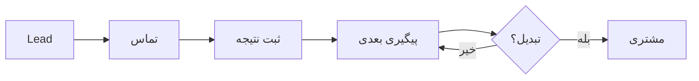
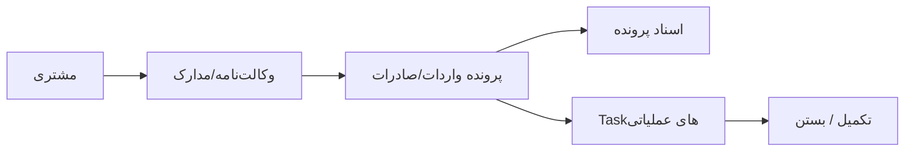
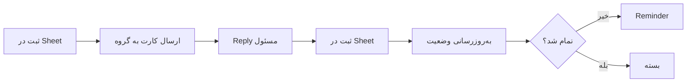

# شرح پروژه کاراترخیص

## خلاصه اجرایی

**کاراترخیص** یک CRM عملیاتی تخصصی برای تیم‌های ترخیص کالا، کارگزاری گمرکی، بازرگانی و خدمات تجارت خارجی است. هدف سیستم این است که اطلاعات مشتری، لید، پرونده، اسناد، Task، پیگیری، گزارش و اعلان‌ها را در یک جریان کاری ساده و قابل ردیابی یکپارچه کند.

این سیستم به‌جای اینکه یک CRM عمومی با ده‌ها قابلیت غیرضروری باشد، حول عملیات واقعی یک دفتر ترخیص طراحی شده است: «چه شرکتی باید پیگیری شود؟»، «مسئول هر کار چه کسی است؟»، «پرونده در چه مرحله‌ای است؟»، «اسناد کجا هستند؟»، «کدام Task عقب افتاده؟» و «مدیر برای تصمیم‌گیری چه چیزهایی باید ببیند؟».

---

## مسئله کسب‌وکار

در بسیاری از دفاتر ترخیص، اطلاعات در چند محل پراکنده می‌شوند:

- فایل Excel یا Google Sheet
- پیام‌های Telegram و WhatsApp
- پوشه‌های Drive
- تماس تلفنی
- یادداشت شخصی
- حافظه افراد

این پراکندگی باعث می‌شود:

- پیگیری مشتری فراموش شود.
- مسئول یک Task مشخص نباشد.
- تغییر وضعیت کار بدون تاریخچه بماند.
- مدیر برای گرفتن گزارش مجبور به پرسش دستی شود.
- فایل‌ها و مجوزها از رکورد پرونده جدا بمانند.
- وابستگی کسب‌وکار به یک فرد افزایش پیدا کند.

کاراترخیص این مشکل را با اتصال Google Workspace و Telegram حل می‌کند.

---

## مخاطبان هدف

### 1. دفاتر ترخیص کالا

تیم‌هایی که پرونده‌های واردات و صادرات را برای مشتریان مختلف مدیریت می‌کنند و نیاز دارند همه فعالیت‌ها، مسئولیت‌ها و اسناد قابل پیگیری باشند.

### 2. شرکت‌های بازرگانی

کسب‌وکارهایی که واردات/صادرات، مجوزها، اسناد تجاری و پیگیری‌های متعدد دارند.

### 3. کارگزاران گمرکی

کارگزارانی که هم‌زمان چند صاحب کالا و چند پرونده فعال دارند.

### 4. تیم‌های فروش خدمات B2B

تیم‌هایی که باید شرکت‌های هدف را شناسایی، تماس‌ها را ثبت و مسیر تبدیل لید به مشتری را مدیریت کنند.

---

## اهداف اصلی محصول

1. ایجاد **Single Source of Truth** برای عملیات روزانه.
2. جلوگیری از فراموش شدن Task و پیگیری.
3. تعیین مسئول شفاف برای هر فعالیت.
4. نگهداری تاریخچه قابل ردیابی در Telegram و Sheet.
5. اتصال مستقیم پرونده به پوشه اسناد Drive.
6. ساخت نمای 360 درجه از هر شرکت.
7. ارائه گزارش عملیاتی به مدیر بدون جمع‌آوری دستی اطلاعات.
8. تفکیک داده تیمی از داده شخصی و محرمانه.
9. ایجاد بستر توسعه برای Reminder، Escalation و Automation بیشتر.

---

## تمایز با CRMهای عمومی

| موضوع | CRM عمومی | کاراترخیص |
|---|---|---|
| تمرکز | فروش عمومی | ترخیص، گمرک، پرونده و عملیات |
| اسناد | Attachment عمومی | پوشه پرونده و دسته‌بندی اسناد Drive |
| ارتباط تیم | Inbox داخلی CRM | Telegram Group عملیاتی |
| ورود داده | فرم‌های نرم‌افزاری | Google Sheets + فرم‌های ساده |
| پرونده واردات/صادرات | معمولاً سفارشی‌سازی لازم دارد | مفهوم اصلی سیستم |
| کار روزانه | Task عمومی | Task با Reply Lifecycle در Telegram |
| شرکت | Contact/Account | Lead + Task + Case + Balance + Docs |
| استقرار | SaaS مستقل | Google Workspace + Telegram |
| هزینه و پیچیدگی | معمولاً بالاتر | مناسب تیم کوچک و متوسط |

---

## نقش‌ها و دسترسی‌ها

### مدیر

مدیر باید بتواند:

- وضعیت کلی تیم را مشاهده کند.
- Taskهای روز و عقب‌افتاده را ببیند.
- پرونده‌ها و هشدارها را مرور کند.
- بازاریابی و پیگیری‌ها را کنترل کند.
- وضعیت شرکت‌ها را به‌صورت 360 درجه بررسی کند.
- در Private Bot به اطلاعات مدیریتی دسترسی داشته باشد.

### کارمند / اپراتور

کارمند باید بتواند:

- Taskهای خودش را ببیند.
- روی کارت Task در گروه Reply کند.
- نتیجه و وضعیت را ثبت کند.
- پرونده‌های مرتبط با خودش را مشاهده کند.
- از Private Bot خلاصه فردی دریافت کند.

### فروش

در V4.9.2 نقش فروش به‌صورت Role مستقل UI نشده و معمولاً به‌عنوان کارمند فعال تعریف می‌شود. جریان مورد انتظار:

- مشاهده Leadهای واگذارشده
- ثبت تماس و نتیجه
- تعیین اقدام بعدی
- Escalation لیدهای بدون پاسخ

### پشتیبان

پشتیبان نیز در نسخه فعلی Role جداگانه کامل ندارد و می‌تواند به‌عنوان کارمند ثبت شود. در نسخه آتی بهتر است Permission Matrix مستقل داشته باشد.

### مشتری

مشتری در نسخه فعلی «کاربر نرم‌افزار» نیست؛ یک Entity در CRM است. اطلاعات وی شامل مشخصات تماس، اطلاعات حقوقی/حقیقی، وکالت‌نامه، اسناد و پرونده‌هاست.

---

## ماژول‌های محصول

### مخاطبین و مشتریان

- ثبت شخص حقیقی یا حقوقی
- اطلاعات تماس
- اطلاعات ثبتی
- وکالت‌نامه
- پوشه اسناد مستقل
- افزودن خودکار نام مشتری به لیست شرکت‌ها

### بازاریابی و لید

- ثبت Lead
- مرحله فروش
- مسئول
- نتیجه تماس
- پیگیری بعدی
- Reminder و Escalation

### Task Management

- Task روزانه
- مالک Task
- اولویت
- موعد
- وضعیت
- نتیجه
- اقدام بعدی
- کارت Telegram
- Reply Lifecycle

### مدیریت پرونده

- واردات / صادرات
- شماره پرونده واقعی
- کوتاژ/سند
- مسئول
- وضعیت
- پوشه اسناد

### Document Management

- Drive Folder اختصاصی
- ساختار استاندارد زیرپوشه
- ایندکس در Sheet
- لینک مستقیم از پرونده یا مشتری

### گزارش‌گیری

- گزارش روزانه اجرایی
- گزارش هفتگی بازاریابی
- نمای وضعیت امروز/فردا
- هشدار Taskهای عقب‌افتاده
- گزارش ماهانه جامع در Roadmap

### اعلان‌ها

- Task جدید
- تغییر وضعیت
- Reminder Task
- Reminder/Esclation لید
- هشدارهای مدیریتی
- هشدار انقضای وکالت‌نامه در Roadmap

---

## Workflowهای اصلی

### Lead تا مشتری

### مشتری تا پرونده

### Task تا نتیجه

---

## یکپارچه‌سازی‌ها

### Google Sheets

نقش Database عملیاتی سبک و UI فرم‌ها را دارد.

### Google Drive

محل نگهداری فایل‌های پرونده و مشتری است.

### Google Apps Script

Business Logic، Triggerها، Sync و Webhook Handler را اجرا می‌کند.

### Telegram

رابط اصلی عملیات تیمی و Private Dashboard است.

### Vercel Relay

به‌عنوان واسط پایدار بین Telegram Webhook و Apps Script استفاده می‌شود.

---

## ملاحظات امنیتی

- توکن Telegram هرگز در Repository Commit نشود.
- Secretها فقط در Script Properties قرار گیرند.
- Repository عمومی نباید شامل Export واقعی مشتریان باشد.
- Drive Folderها فقط با افراد لازم Share شوند.
- Telegram Group نباید محل نمایش داده محرمانه مشتری باشد.
- Private Bot باید برای داده شخصی و مدیریتی استفاده شود.
- Audit Log برای عملیات مهم حفظ شود.

---

## محدودیت‌های شناخته‌شده V4.9.2

- کد تاریخی به‌صورت Patchهای متعدد رشد کرده و هنوز تعدادی Function Override قدیمی دارد.
- Triggerهای گزارش Legacy و Setup جدید کاملاً یکپارچه نشده‌اند.
- گزارش ماهانه جامع هنوز تکمیل نشده است.
- Reminder خودکار انقضای وکالت‌نامه در مدل داده پیش‌بینی شده، اما Scheduler آن کامل نشده است.
- Roleهای «فروش» و «پشتیبان» هنوز Permission Matrix مستقل ندارند.
- مشتری Account/Login مستقل ندارد.

این موارد باید در Refactor V5 به‌عنوان اولویت فنی در نظر گرفته شوند.
