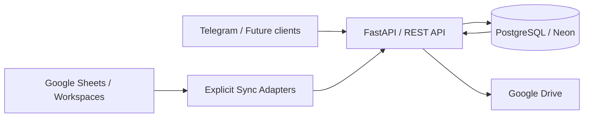

# کاراترخیص — CRM عملیات ترخیص، فروش و پیگیری

> **Karatarkhis CRM** سامانه عملیاتی مدیریت مشتری، پرونده گمرکی، تخصیص مسئول، Task، اسناد و یکپارچگی Google Workspace/Telegram است.

## وضعیت نسخه

| مورد | وضعیت |
|---|---|
| نسخه Backend در حال توسعه | `5.0.0-dev` |
| شاخه توسعه | `feature/v5-backend-foundation` |
| Pull Request | [#1 — V5 backend foundation](https://github.com/sajedfallah/CRM-karatarkhis/pull/1) |
| Backend | FastAPI + SQLAlchemy 2 + PostgreSQL/Neon |
| Deployment توسعه | Vercel Preview |
| Migration فعلی DEV | `0004_documents` |
| Production فعلی | V4.9.2 / بدون تغییر توسط این شاخه |
| وضعیت `main` | بدون Merge این تغییرات تا زمان Review |

> **وضعیت داده DEV در 2026-09-17:** بنا بر تصمیم عملیاتی، داده‌های DEV تخلیه شده‌اند و Schema تا Migration `0004_documents` حفظ شده است. بنابراین محیط DEV در حال حاضر برای Seed/Import کنترل‌شده آماده است.

## معماری V5



اصل معماری V5 این است که **PostgreSQL منبع حقیقت مرکزی (Source of Truth)** باشد. Google Sheets و Workspaceها رابط عملیاتی/مدیریتی هستند و نباید به دیتابیس دوم ضمنی تبدیل شوند.

## قابلیت‌های پیاده‌سازی‌شده در V5

- FastAPI application و OpenAPI
- PostgreSQL/Neon با SQLAlchemy 2
- Alembic migrations (`0001` تا `0004`)
- Customer / User / Permission / Case / Assignment / Audit models
- Case CRUD و Assignment lifecycle
- Server-side authorization با Tenant Boundary و Scopeهای `GLOBAL` / `CUSTOMER` / `ASSIGNED`
- Task و Task Message/Thread API
- Document metadata، Approval/Reject و Expiry metadata
- Google Sheets customer/case sync adapters
- Controlled manual sync endpoint با Dry Run
- Health checks برای API، Database و Google Sheets
- Vercel Preview deployment
- Audit Log برای عملیات اصلی

## APIهای اصلی

```text
GET  /health
GET  /health/db
GET  /health/sheets

GET  /api/v1/users/me
GET  /api/v1/users/me/permissions

GET  /api/v1/cases
POST /api/v1/cases
GET  /api/v1/cases/{case_id}
PATCH /api/v1/cases/{case_id}
GET  /api/v1/cases/{case_id}/assignments
POST /api/v1/cases/{case_id}/assignments
DELETE /api/v1/cases/{case_id}/assignments/{assignment_id}

GET  /api/v1/tasks
POST /api/v1/tasks
GET  /api/v1/tasks/{task_id}
PATCH /api/v1/tasks/{task_id}
GET  /api/v1/tasks/{task_id}/messages
POST /api/v1/tasks/{task_id}/messages

GET  /api/v1/documents
POST /api/v1/documents
GET  /api/v1/documents/{document_id}
PATCH /api/v1/documents/{document_id}
POST /api/v1/documents/{document_id}/approval

POST /api/v1/sync/manual
```

## Migrationهای دیتابیس

| Migration | هدف |
|---|---|
| `0001_initial_v5_schema` | Customers, Users, Cases, Permissions, Assignments, Audit Logs |
| `0002_case_sync_metadata` | `sync_version`, `sync_source`, `sync_updated_at` برای Case |
| `0003_tasks` | Tasks و Task Messages |
| `0004_documents` | Document metadata، approval و expiry |

## امنیت و دسترسی

Authorization در Backend اعمال می‌شود و Google Sheet validation یا مخفی‌کردن Tab به‌عنوان مرز امنیتی پذیرفته نیست.

مدل تصمیم‌گیری دسترسی:

```text
User → Active State → Role → Customer/Tenant Boundary → Permission Profile → Scope → Assignment → Action
```

احراز هویت فعلی `X-User-ID` **فقط DEV/STAGING adapter** است. در `production` این adapter عمداً فعال نیست و تا قبل از پیاده‌سازی Identity واقعی، Production API نباید با آن منتشر شود.

## Google Workspace

Spreadsheet پایه عملیاتی فعلی:

**CRM | ترخیص یزد | V1.5 | 2026-09-17**

Google Drive شامل ساختارهای مستقل برای اسناد مشتری و اسناد پرونده است. Credentialهای واقعی Google، Telegram tokenها، Database credentials و فایل‌های خصوصی هرگز نباید داخل Git commit شوند.

## Infrastructure

- **Database:** Neon PostgreSQL
- **App Hosting:** Vercel Preview
- **CI/CD:** در حال حاضر GitHub Actions تعریف نشده؛ Vercel Git Integration روی commitهای شاخه Feature Preview می‌سازد.
- **Containers:** Docker/Kubernetes در V5 فعلی استفاده نشده‌اند.
- **Cache/Queue:** Redis، RabbitMQ، Kafka یا Queue مستقل فعلاً وجود ندارد.
- **Protocol:** REST/HTTP + JSON
- **Architecture:** Modular monolith؛ microservice architecture پیاده‌سازی نشده است.

## Dependencies

Dependency constraints در `backend/requirements.txt` نگهداری می‌شوند. نسخه‌ها به‌صورت Range تعریف شده‌اند و **lockfile حاوی نسخه resolve‌شده دقیق فعلاً وجود ندارد**. پیش از Production باید dependency locking و reproducible build اضافه شود.

## اجرای محلی Backend

```bash
cd backend
python -m venv .venv
# Windows: .venv\Scripts\activate
# Linux/macOS: source .venv/bin/activate
pip install -r requirements.txt
cp .env.example .env
alembic upgrade head
uvicorn app.main:app --reload
```

هیچ Secret واقعی را داخل `.env.example` یا GitHub قرار ندهید.

## مستندات نسخه V5

- [CHANGELOG.md](CHANGELOG.md) — لیست تغییرات و اصلاحات
- [docs/V5_TECHNICAL_AND_OPERATIONS.md](docs/V5_TECHNICAL_AND_OPERATIONS.md) — مستند جامع فنی و عملیاتی
- [docs/V5_MIGRATION_GUIDE.md](docs/V5_MIGRATION_GUIDE.md) — راهنمای مهاجرت و Rollout
- [docs/V5_QA_REPORT.md](docs/V5_QA_REPORT.md) — تست‌ها، شواهد و Gapهای QA
- [backend/README.md](backend/README.md) — راهنمای Backend

## وضعیت Release

V5 هنوز **Development/Preview** است و Release Production محسوب نمی‌شود. قبل از Merge/Production موارد زیر باید تکمیل شوند: Production authentication، runtime Google credential strategy، automated test suite/CI، dependency lock، E2E permission regression، backup/restore drill و production migration rehearsal.
