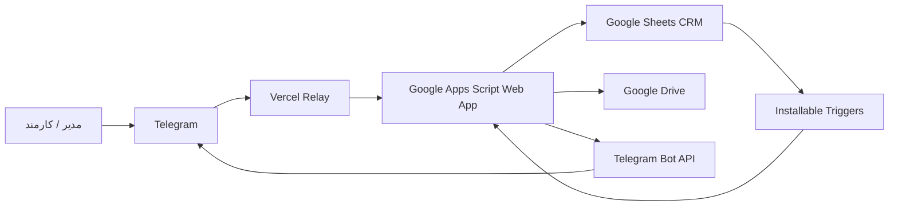

# کاراترخیص — CRM عملیات ترخیص، فروش و پیگیری

> **Karatarkhis CRM** یک CRM عملیاتی برای کسب‌وکارهای ترخیص کالا، کارگزاری گمرکی، بازرگانی و تیم‌های کوچک خدمات تجارت خارجی است که Google Sheets، Google Drive، Google Apps Script و Telegram را در یک جریان کاری واحد به هم متصل می‌کند.

## وضعیت پروژه

- نسخه عملیاتی مبنای این مستندات: **V4.9.2**
- منطقه زمانی سیستم: `Asia/Tehran`
- هسته اجرایی: Google Apps Script
- دیتاست اصلی: Google Sheets
- بایگانی اسناد: Google Drive
- رابط عملیات تیمی: Telegram Group
- رابط شخصی/محرمانه: Telegram Private Bot
- Webhook: Telegram → Vercel Relay → Apps Script Web App

> **نکته مهم:** در زمان ایجاد این مستندات، ریپازیتوری GitHub تازه ایجاد شده و سورس Production هنوز به‌صورت کامل به GitHub منتقل نشده است. توضیحات فنی بر اساس نسخه عملیاتی V4.9.2 و ساختار فعلی سیستم تهیه شده‌اند. قبل از هر Release جدید، سورس Production باید به ریپازیتوری منتقل و با Apps Script همگام شود.

---

## 1. مسئله‌ای که کاراترخیص حل می‌کند

در کسب‌وکار ترخیص و تجارت خارجی، اطلاعات معمولاً بین تماس تلفنی، واتساپ/تلگرام، فایل‌های Drive، اکسل، یادداشت شخصی و حافظه افراد پراکنده است. نتیجه این پراکندگی معمولاً یکی از موارد زیر است:

- فراموش شدن پیگیری شرکت یا مشتری
- نامشخص بودن مسئول هر کار
- نبود تاریخچه شفاف برای Taskها
- گم شدن اسناد پرونده
- عدم اتصال پرونده، مشتری، اسناد و فعالیت روزانه
- دشواری نظارت مدیر بر عملکرد تیم
- نبود هشدار برای کار عقب‌افتاده
- نبود نمای واحد از وضعیت یک شرکت

کاراترخیص این اجزا را در یک CRM سبک و عملیاتی جمع می‌کند تا تیم بدون نیاز به نرم‌افزار سازمانی پیچیده بتواند فرایند خود را ثبت، پیگیری و کنترل کند.

---

## 2. مناسب چه کسب‌وکارهایی است؟

سیستم برای این گروه‌ها طراحی شده است:

- ترخیص‌کاران و کارگزاران گمرکی
- شرکت‌های خدمات بازرگانی
- تیم‌های واردات و صادرات
- شرکت‌های لجستیکی کوچک و متوسط
- دفاتر پیگیری امور گمرکی
- تیم‌هایی که Telegram و Google Workspace بخش اصلی عملیات روزانه آن‌هاست

---

## 3. نقش‌های کاربری

| نقش | وضعیت در V4.9.2 | دسترسی اصلی |
|---|---|---|
| مدیر | پیاده‌سازی شده | گزارش‌ها، هشدارها، پرونده‌ها، تیم، بازاریابی، نمای کلی شرکت‌ها |
| کارمند/اپراتور | پیاده‌سازی شده | Taskهای خود، پرونده‌های مرتبط، پیگیری‌های خود، اطلاعات مجاز |
| فروش | در مدل فعلی به‌عنوان کارمند فعال قابل استفاده است | لیدها، پیگیری فروش، نتیجه تماس، اقدام بعدی |
| پشتیبان | نقش مجزای UI هنوز کامل نشده؛ می‌تواند به‌عنوان کارمند ثبت شود | Task و پرونده‌های واگذارشده |
| مشتری | در حال حاضر **رکورد CRM** است و حساب کاربری مستقل ندارد | اطلاعات هویتی/تماس، اسناد، وکالت‌نامه و پرونده‌ها |

احراز هویت داخلی Telegram بر اساس `Telegram User ID` و رجیستری شیت `کارمندان` انجام می‌شود.

---

## 4. ماژول‌های اصلی

### 4.1 مدیریت Task

شیت اصلی: `کارهای روزانه`

هر Task شامل تاریخ، مسئول، دسته‌بندی، شرح کار، شرکت مرتبط، اولویت، موعد، وضعیت، نتیجه، اقدام بعدی، یادداشت مدیریتی، شناسه پایدار و شناسه پیام Telegram است.

چرخه استاندارد:

```text
ایجاد Task
  ↓
اختصاص به مسئول
  ↓
ارسال کارت Task به گروه Telegram
  ↓
Reply مسئول روی همان کارت
  ↓
ثبت وضعیت/نتیجه در Sheet
  ↓
ویرایش کارت/ثبت تاریخچه
  ↓
تکمیل یا ادامه پیگیری
```

Taskهای جدید از شناسه `KRT-XXXXXXXX` استفاده می‌کنند و شناسه‌های Legacy با الگوی `ARD-XXXXXXXX` نیز پشتیبانی می‌شوند.

### 4.2 بازاریابی و لید

شیت‌ها:

- `سرنخ‌ها`
- `بازاریابی و پیگیری`

اطلاعات لید شامل شرکت، رابط، تلفن، حوزه فعالیت، منبع، مرحله فروش، مسئول، آخرین تماس، نتیجه، اقدام بعدی و زمان پیگیری است.

برای لیدهای واگذارشده منطق Reminder و Escalation در کد وجود دارد؛ نسخه فعلی دارای منطق 48 ساعته و 72 ساعته برای برخی جریان‌های Legacy است.

### 4.3 پرونده‌های گمرکی

فرم: `پرونده جدید`

پرونده شامل:

- مشتری / صاحب کالا
- نوع پرونده: واردات یا صادرات
- شماره پرونده واقعی واردشده توسط کاربر
- شماره کوتاژ / سند اختیاری
- وضعیت پرونده
- مسئول
- یادداشت
- لینک پوشه اسناد

**شماره پرونده اصلی سیستم همان شماره‌ای است که کاربر ثبت می‌کند.**

پرونده‌های واردات و صادرات در پوشه‌های Drive مجزا دسته‌بندی می‌شوند.

### 4.4 اسناد پرونده

برای هر پرونده پوشه اختصاصی Drive ساخته/بازیابی می‌شود. زیرپوشه‌های استاندارد:

```text
01-اسناد تجاری
02-حمل و قبض انبار
03-مجوزها و بازرسی
04-گمرک و ترخیص
99-سایر
```

Sync اسناد، فایل‌های موجود را در شیت `اسناد پرونده‌ها` ایندکس می‌کند.

### 4.5 مدیریت مشتری

فرم: `مشتری جدید`

اطلاعات قابل ثبت:

- حقیقی / حقوقی
- نام یا عنوان مشتری
- شناسه ملی / کد ملی
- شماره ثبت
- کد اقتصادی
- شخص رابط
- موبایل، تلفن، ایمیل
- شهر و آدرس
- تاریخ شروع و پایان وکالت‌نامه
- یادداشت

برای هر مشتری پوشه Drive مستقل با زیرپوشه‌های زیر ایجاد می‌شود:

```text
01-وکالت‌نامه
02-مجوزها
03-مدارک ثبتی
99-سایر
```

در V4.9.2 وضعیت وکالت‌نامه و روزهای باقی‌مانده در مدل داده پیش‌بینی شده‌اند. **ارسال خودکار هشدار Telegram برای انقضای وکالت‌نامه هنوز باید در نسخه بعدی به Scheduler یکپارچه اضافه شود.**

### 4.6 Telegram Group

گروه برای عملیات شفاف تیمی استفاده می‌شود:

- کارت Task
- Reply نتیجه و تغییر وضعیت
- Reminder عقب‌افتادگی
- گزارش‌های اجرایی
- هشدارها و Escalationهای تیمی

### 4.7 Telegram Private

Private Bot برای اطلاعات شخصی و دسترسی Role-Based است. منوی دائمی نمایش داده می‌شود و استفاده روزانه نیاز به تایپ دستور ندارد.

اطلاعات محرمانه یا شخصی باید در Private باقی بماند؛ عملیات تیمی Task بهتر است در گروه انجام شود.

---

## 5. نمای 360 درجه شرکت

جستجوی شرکت می‌تواند اطلاعات چند منبع را کنار هم قرار دهد:

- اطلاعات لید/بازاریابی
- تعداد پرونده‌ها
- Taskهای باز
- مسئول
- اقدام بعدی
- مانده حساب موجود در رکوردهای پرونده

این قابلیت برای پاسخ سریع به سؤال «الان وضعیت این شرکت چیست؟» طراحی شده است.

---

## 6. معماری سطح بالا



جزئیات بیشتر: [ARCHITECTURE.md](ARCHITECTURE.md)

---

## 7. پیش‌نیازها

- حساب Google با دسترسی به Spreadsheet و Drive پروژه
- Google Apps Script Project
- Telegram Bot ایجادشده با BotFather
- Telegram Group برای عملیات تیمی
- Vercel Project برای Relay وب‌هوک
- دسترسی Editor/Owner به فایل‌های Google Workspace
- Git برای توسعه محلی اختیاری
- Node.js فقط برای Syntax Check محلی اختیاری

---

## 8. تنظیم Script Properties

اطلاعات حساس **نباید در سورس یا GitHub ذخیره شوند**.

حداقل Propertyها:

| Key | کاربرد |
|---|---|
| `BOT_TOKEN` | توکن جدید Telegram Bot |
| `GROUP_CHAT_ID` | Chat ID گروه عملیاتی |
| `SPREADSHEET_ID` | شناسه Spreadsheet CRM |
| `WEB_APP_URL` | URL Web App در صورت نیاز |
| `CUSTOMER_DOCS_ROOT_FOLDER_ID` | ریشه اسناد مشتریان |
| `CASE_IMPORT_ROOT_FOLDER_ID` | ریشه پرونده‌های واردات |
| `CASE_EXPORT_ROOT_FOLDER_ID` | ریشه پرونده‌های صادرات |

نمونه مفهومی:

```text
BOT_TOKEN=<secret>
GROUP_CHAT_ID=<telegram-group-id>
SPREADSHEET_ID=<google-sheet-id>
```

هرگز مقدار واقعی این کلیدها را در Commit قرار ندهید.

---

## 9. نصب اولیه

1. سورس نسخه موردنظر را در Apps Script قرار دهید.
2. Script Properties را تنظیم کنید.
3. فایل را Save و Apps Script را Refresh کنید.
4. تابع Setup نسخه جاری را اجرا کنید؛ برای V4.9.2 تابع اصلی `setupV492()` است.
5. مجوزهای Spreadsheet، Drive و External Request را تأیید کنید.
6. Web App را Deploy/Update کنید.
7. Webhook Telegram را روی Relay فعال بررسی کنید.
8. اتصال Telegram، Sheet و Drive را تست کنید.

> **هشدار V4.9.2:** تابع Legacy با نام `installTriggers()` با Setup جدید کاملاً Consolidate نشده است و اجرای بدون بررسی آن می‌تواند Trigger اضافی `onTaskEdit` ایجاد کند. قبل از فعال‌سازی گزارش‌های زمان‌بندی‌شده، [DEPLOYMENT.md](DEPLOYMENT.md) و بخش Technical Debt در [ARCHITECTURE.md](ARCHITECTURE.md) را بخوانید.

---

## 10. راهنمای استفاده روزانه

### ایجاد Task

در `کارهای روزانه` ردیف جدید بسازید، مسئول و جزئیات را تعیین و Checkbox «ارسال به کارمند» را فعال کنید. Sender کارت Task را به گروه ارسال و `Telegram Message ID` را ذخیره می‌کند.

### ثبت پرونده

در `پرونده جدید` فرم را پر کنید و Checkbox «ثبت پرونده» را بزنید. پس از ثبت، لینک پوشه اسناد نمایش داده می‌شود. برای پرونده بعدی Checkbox «➕ پرونده جدید» را بزنید.

### ثبت مشتری

در `مشتری جدید` فرم را تکمیل و «ثبت مشتری» را فعال کنید. پس از ثبت، شناسه مشتری و پوشه اسناد ساخته می‌شود. «➕ مشتری جدید» فرم را بدون حذف رکورد قبلی Reset می‌کند.

### ثبت نتیجه Task

مسئول روی کارت اصلی Task در گروه Reply می‌کند. سیستم شناسه Task را از پیام تشخیص داده و نتیجه/وضعیت را به Sheet برمی‌گرداند.

---

## 11. گزارش‌ها

در نسخه عملیاتی فعلی:

- گزارش روزانه اجرایی وجود دارد.
- گزارش صبح و پایان روز در توابع Legacy تعریف شده‌اند.
- گزارش هفتگی بازاریابی وجود دارد.
- گزارش ماهانه جامع هنوز در V4.9.2 نهایی نشده است.

به‌دلیل پراکندگی Triggerهای Legacy و Setup جدید، Scheduler گزارش‌ها باید در Refactor بعدی یکپارچه شود.

---

## 12. امنیت و حریم خصوصی

- Token ربات فقط در Script Properties نگهداری شود.
- Telegram User ID فقط برای احراز نقش داخلی استفاده شود.
- اطلاعات هویتی مشتری و اسناد تجاری در مخزن GitHub Commit نشوند.
- Repo فعلی **Public** است؛ بنابراین هیچ Secret، Export واقعی Sheet یا سند مشتری نباید در آن قرار گیرد.
- پوشه‌های Drive باید با اصل Least Privilege Share شوند.
- اطلاعات Private Bot نباید به گروه عمومی تیمی منتقل شود.
- Webhook باید فقط Payload Telegram را Relay کند و از لاگ‌کردن Secret جلوگیری شود.

جزئیات: [SECURITY.md](SECURITY.md)

---

## 13. ساختار پیشنهادی ریپازیتوری

```text
CRM-karatarkhis/
├── README.md
├── DESCRIPTION.md
├── ARCHITECTURE.md
├── API_DOCUMENTATION.md
├── DEPLOYMENT.md
├── CHANGELOG.md
├── CONTRIBUTORS.md
├── SECURITY.md
├── LICENSE
├── .gitignore
└── src/
    └── Code.gs          # پس از انتقال سورس Production
```

---

## 14. وضعیت قابلیت‌ها

| قابلیت | وضعیت |
|---|---|
| Task + Telegram Group | فعال |
| Reply Lifecycle | فعال |
| Role-based Private Menu | فعال |
| مدیریت لید | فعال |
| ثبت پرونده | فعال |
| واردات / صادرات | فعال در فرم و Drive routing |
| Sync اسناد پرونده | فعال |
| ثبت مشتری | فعال |
| پوشه اسناد مشتری | فعال |
| تاریخ وکالت | مدل داده فعال |
| هشدار خودکار انقضای وکالت | در انتظار تکمیل Scheduler |
| گزارش روزانه | موجود |
| گزارش هفتگی بازاریابی | موجود |
| گزارش ماهانه جامع | برنامه‌ریزی‌شده |
| API عمومی برای مشتریان خارجی | وجود ندارد |

---

## 15. توسعه و مشارکت

قبل از تغییر Production، Branch جداگانه بسازید و تغییرات را از طریق Pull Request وارد `main` کنید. استانداردها در [CONTRIBUTORS.md](CONTRIBUTORS.md) آمده‌اند.

---

## 16. مجوز

این پروژه در حال حاضر نرم‌افزار اختصاصی است و Open Source محسوب نمی‌شود. شرایط در [LICENSE](LICENSE) آمده است.

---

## 17. مستندات تکمیلی

- [شرح محصول و مسئله](DESCRIPTION.md)
- [معماری فنی](ARCHITECTURE.md)
- [مستند API و Webhook](API_DOCUMENTATION.md)
- [راهنمای Deployment](DEPLOYMENT.md)
- [تاریخچه تغییرات](CHANGELOG.md)
- [راهنمای مشارکت](CONTRIBUTORS.md)
- [امنیت](SECURITY.md)
