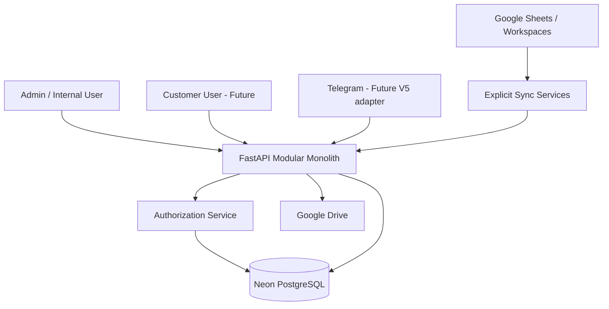

# V5 Technical & Operations Documentation

نسخه سند: `2026-09-17`  
شاخه: `feature/v5-backend-foundation`  
PR اصلی: [#1](https://github.com/sajedfallah/CRM-karatarkhis/pull/1)

## 1. Executive Summary

V5 یک بازطراحی Backend است که هدف آن تبدیل CRM از معماری وابسته به Google Apps Script/Sheet به معماری دارای Backend مرکزی، authorization سمت سرور و PostgreSQL به‌عنوان Source of Truth است. Production فعلی V4.9.2 توسط این شاخه تغییر نکرده است.

وضعیت فعلی:

- Backend: FastAPI
- ORM: SQLAlchemy 2
- DB: PostgreSQL روی Neon
- Migration: Alembic تا `0004_documents`
- Deployment: Vercel Preview
- API protocol: REST + JSON
- معماری: Modular Monolith
- Production Auth: هنوز پیاده‌سازی نشده
- DEV database data: خالی؛ schema حفظ شده است

## 2. Scope این نسخه

### تکمیل شده

- Backend foundation
- DB schema و migrations
- User/Role/Permission base
- Case CRUD
- Case Assignment lifecycle
- Task/Message thread
- Document metadata/approval
- Audit logging
- Google Sheets sync foundation
- Manual controlled sync
- Health checks
- Vercel preview deployment

### خارج از Scope یا ناقص

- Production authentication
- Full Telegram V5 integration
- Notifications engine
- Partial Clearance
- Customer portal end-to-end
- Automated CI test pipeline
- Containerized deployment
- Redis / Queue
- Production migration rollout

## 3. Architecture



### تصمیمات معماری

1. PostgreSQL منبع حقیقت مرکزی است.
2. Google Sheets رابط عملیاتی و sync surface است، نه security boundary.
3. Authorization باید قبل از هر عملیات حساس در Backend انجام شود.
4. شناسه‌های `User`, `Customer`, `Case` immutable هستند.
5. Sync باید explicit، idempotent و audit-able باشد.
6. V5 در این مرحله Modular Monolith است؛ تقسیم زودهنگام به microservice انجام نشده است.

## 4. Backend Structure

```text
backend/
├── api/index.py
├── app/
│   ├── api/
│   │   ├── deps.py
│   │   └── v1/
│   │       ├── cases.py
│   │       ├── documents.py
│   │       ├── manual_sync.py
│   │       ├── router.py
│   │       ├── tasks.py
│   │       └── users.py
│   ├── cli/sync.py
│   ├── core/config.py
│   ├── db/
│   ├── integrations/google_sheets.py
│   ├── models/core.py
│   ├── schemas/
│   ├── services/
│   └── main.py
├── alembic/
├── requirements.txt
└── vercel.json
```

## 5. Data Model

### Customer

فیلدهای کلیدی:

- `id` — immutable، مانند `CUS-001`
- `name`
- `is_active`
- timestamps

### User

- `id` — immutable
- `full_name`
- `mobile`
- `email`
- `telegram_user_id`
- `role`
- `customer_id`
- `permission_profile`
- `is_active`
- `workspace_url`

Roleهای رسمی:

- `admin`
- `internal_employee`
- `customer_manager`
- `customer_employee`

### Permission

Permission به‌صورت action-based و scope-based است:

- `can_view`
- `can_create`
- `can_edit`
- `can_assign`
- `can_approve_documents`
- `can_finance`

Scopeها:

- `GLOBAL`
- `CUSTOMER`
- `ASSIGNED`

### Case

- immutable `id`
- `customer_id`
- `real_case_number`
- `operation_type`
- `customs`
- `status`
- sync metadata
- `created_by`

Sync metadata:

- `sync_version`
- `sync_source`
- `sync_updated_at`

### CaseAssignment

- `case_id`
- `user_id`
- `customer_id`
- `assignment_type`
- `is_primary`
- `is_active`
- `assigned_by`
- `assigned_at`
- `ended_at`

Business invariant: تنها یک Primary Internal Assignment فعال برای هر پرونده مجاز است.

### Task

- relation: `Customer` یا `Case`
- customer/case linkage
- title/category
- creator/assignee
- priority/status/due date
- manager escalation flag
- result/next action/notes

### TaskMessage

Thread ساده برای Task با sender، body، source و timestamp.

### Document

- customer linkage
- optional case linkage
- document type/title
- Google Drive file ID / URL
- MIME type
- version
- status
- uploader
- approver/approval timestamp
- expiration timestamp
- notes

### AuditLog

برای تغییرات مهم:

- actor
- entity type/id
- action
- field
- old/new value
- source
- timestamp

## 6. Database Migrations

### `0001_initial_v5_schema`

Schema پایه شامل customer/user/case/permission/assignment/audit.

### `0002_case_sync_metadata`

اضافه‌کردن metadata برای تشخیص منبع و نسخه sync.

### `0003_tasks`

ایجاد:

- `tasks`
- `task_messages`
- indexes روی customer/case/assignee/status/due date

### `0004_documents`

ایجاد `documents` و indexهای:

- customer
- case
- status
- expires_at

### وضعیت فعلی DEV

Migration `0004_documents` روی DEV اعمال شده است. پس از آن، طبق تصمیم عملیاتی، داده‌های DEV پاک شدند ولی Schema و Alembic state نگه داشته شدند.

## 7. API Contract

### System

- `GET /health`
- `GET /health/db`
- `GET /health/sheets`

### Users

- `GET /api/v1/users/me`
- `GET /api/v1/users/me/permissions`

### Cases

- `GET /api/v1/cases`
- `POST /api/v1/cases`
- `GET /api/v1/cases/{case_id}`
- `PATCH /api/v1/cases/{case_id}`
- `GET /api/v1/cases/{case_id}/assignments`
- `POST /api/v1/cases/{case_id}/assignments`
- `DELETE /api/v1/cases/{case_id}/assignments/{assignment_id}`

### Tasks

- `GET /api/v1/tasks`
- `POST /api/v1/tasks`
- `GET /api/v1/tasks/{task_id}`
- `PATCH /api/v1/tasks/{task_id}`
- `GET /api/v1/tasks/{task_id}/messages`
- `POST /api/v1/tasks/{task_id}/messages`

### Documents

- `GET /api/v1/documents`
- `POST /api/v1/documents`
- `GET /api/v1/documents/{document_id}`
- `PATCH /api/v1/documents/{document_id}`
- `POST /api/v1/documents/{document_id}/approval`

### Sync

- `POST /api/v1/sync/manual`

Manual sync برای عملیات کنترل‌شده و admin-only طراحی شده و dry-run دارد.

## 8. Business Logic

### Authorization Chain

```text
Active User
  → Role
  → Tenant / Customer Boundary
  → Permission Profile
  → Scope
  → Active Assignment if required
  → Requested Action
```

### Case Visibility

- Admin: همه پرونده‌ها
- Customer role: فقط customer خودش
- Internal employee با Scope=`ASSIGNED`: فقط پرونده‌ای که assignment فعال دارد

### Task Visibility

برای Scope=`ASSIGNED`، Task در صورتی قابل مشاهده است که کاربر assignee مستقیم Task باشد یا Task به Caseای متصل باشد که کاربر assignment فعال روی آن دارد.

### Document Authorization

Document access از tenant/customer/case context و permission action استفاده می‌کند. Approval نیازمند permission مناسب است.

### Sync Safety

- مشتری inactive نباید به Case جدید resolve شود.
- match مبهم نباید حدس زده شود.
- Case sync ابتدا DB را commit می‌کند و بعد marker Sheet را به‌روزرسانی می‌کند.
- Audit برای import/sync ثبت می‌شود.

## 9. Known Consistency Risk

اگر DB commit موفق شود ولی نوشتن marker در Sheet شکست بخورد، رکورد DB وارد شده اما Sheet هنوز آن را sync نشده نشان می‌دهد. نیازمند reconciliation/retry job است.

## 10. Infrastructure

### Neon

- PostgreSQL managed database
- Development branch فعال
- Alembic migration state استفاده می‌شود
- Temporary migration branches برای تست schema change استفاده شده‌اند

### Vercel

- Preview deployment از branch feature
- Serverless Python entrypoint: `backend/api/index.py`
- `maxDuration=60`
- routing برای `/health`, `/api/v1/*`, `/docs`, `/openapi.json`

### CI/CD

وضعیت فعلی:

- Git push → Vercel Preview build/deploy
- GitHub Actions: وجود ندارد
- Automated migrations in CI: وجود ندارد
- Automated tests in CI: وجود ندارد

### Containers

- Docker: ندارد
- Docker Compose: ندارد
- Kubernetes: ندارد

### Cache / Queue

- Redis: ندارد
- RabbitMQ: ندارد
- Kafka: ندارد
- Background worker مستقل: ندارد

## 11. Integration & Communication

### Internal service communication

سیستم microservice نیست. Moduleها در یک FastAPI application اجرا می‌شوند و ارتباط داخلی process-local است.

### External protocols

- REST/HTTP JSON
- PostgreSQL protocol از طریق psycopg
- Google Sheets API
- Google Drive links/metadata model
- Telegram Bot token در config رزرو شده، integration V5 کامل نیست

### Google Sheets

روش مطلوب Production:

```text
Sheet / Workspace
  ↕ explicit sync adapter
FastAPI
  ↕
PostgreSQL
```

در DEV، ChatGPT connector می‌تواند Sheet را بخواند و controlled import را تسهیل کند، اما این connector credential runtime Vercel نیست.

### Google Drive

ساختار فعلی مشتریان:

```text
اسناد مشتریان/
├── CUS-001 | فولاد بافق/
│   ├── 01-وکالت‌نامه
│   ├── 02-مجوزها
│   ├── 03-مدارک ثبتی
│   └── 99-سایر
└── CUS-002 | نیک بسپار/
    ├── 01-وکالت‌نامه
    ├── 02-مجوزها
    ├── 03-مدارک ثبتی
    └── 99-سایر
```

ساختار پرونده‌ها شامل ریشه‌های واردات و صادرات است.

## 12. Configuration

متغیرهای اصلی:

```text
APP_NAME
APP_ENV
APP_VERSION
DATABASE_URL
LOG_LEVEL
GOOGLE_SPREADSHEET_ID
GOOGLE_SERVICE_ACCOUNT_JSON_B64
GOOGLE_SERVICE_ACCOUNT_JSON
GOOGLE_SERVICE_ACCOUNT_FILE
GOOGLE_CUSTOMER_DOCS_ROOT_FOLDER_ID
GOOGLE_CASE_IMPORT_ROOT_FOLDER_ID
GOOGLE_CASE_EXPORT_ROOT_FOLDER_ID
TELEGRAM_BOT_TOKEN
TELEGRAM_WEBHOOK_SECRET
```

هیچ مقدار واقعی Secret نباید در Git ثبت شود.

## 13. Dependencies

| Package | Constraint | Purpose |
|---|---|---|
| FastAPI | `>=0.128,<1.0` | REST API |
| Uvicorn | `>=0.40,<1.0` | ASGI server |
| SQLAlchemy | `>=2.0,<3.0` | ORM |
| Alembic | `>=1.18,<2.0` | DB migrations |
| psycopg[binary] | `>=3.2,<4.0` | PostgreSQL driver |
| pydantic-settings | `>=2.12,<3.0` | Typed env config |
| python-dotenv | `>=1.2,<2.0` | Local env loading |
| google-api-python-client | `>=2.190,<3.0` | Google APIs |
| google-auth | `>=2.40,<3.0` | Google auth |

**محدودیت:** exact resolved versions lock نشده‌اند. برای Production باید lockfile یا hash-pinned requirements ایجاد شود.

## 14. Security

### Authentication

DEV/STAGING:

- Header: `X-User-ID`
- User باید active و موجود در DB باشد

Production:

- adapter فعلی عمداً disable می‌شود
- بدون real auth باید `503 production_auth_not_configured` برگردد

### Authorization

- Server-side
- tenant-aware
- assignment-aware
- permission-profile-aware

### Secrets

ممنوع برای commit:

- `.env`
- DB password/URL واقعی
- service-account JSON
- Telegram token
- webhook secret
- customer export
- document content

### Encryption

V5 در application layer encryption اختصاصی اضافه نکرده است. Transport/managed platform security بر HTTPS و PostgreSQL provider متکی است. اگر field-level encryption لازم شود باید جداگانه طراحی شود.

## 15. Performance & Query Notes

- index روی foreign keyها و فیلدهای پرتکرار Case/Task/Document ایجاد شده است.
- query tuning رسمی با benchmark هنوز انجام نشده است.
- N+1 profiling ثبت نشده است.
- caching وجود ندارد.
- dataset DEV پس از reset خالی است، بنابراین load/performance test فعلاً meaningful نیست.

## 16. Operational Runbook

### Health check

```text
GET /health
GET /health/db
GET /health/sheets
```

### DB migration

1. Migration file ایجاد شود.
2. روی temporary Neon branch تست شود.
3. Schema/result بررسی شود.
4. تأیید انسانی برای apply گرفته شود.
5. روی DEV apply شود.
6. `alembic_version` verify شود.
7. Preview app health check شود.

### Deployment

1. Commit فقط روی feature branch.
2. Vercel preview build.
3. READY verification.
4. OpenAPI route verification.
5. DB/permission checks.
6. Merge به `main` فقط پس از review و production readiness.

## 17. Remaining Production Gates

- Real authentication
- Google backend credential strategy
- automated tests
- CI pipeline
- exact dependency lock
- rate limiting
- structured observability/alerts
- backup/restore drill
- production migration rehearsal
- security regression tests
- Telegram V5 completion
- reconciliation/retry for sync

## 18. Traceability

تمام تغییرات V5 فعلی تحت PR #1 هستند. در Repository برای این workstream Issue مستقل ثبت نشده است؛ بنابراین مستندات از PR، commit history، migration files و verificationهای DEV استفاده می‌کنند.
